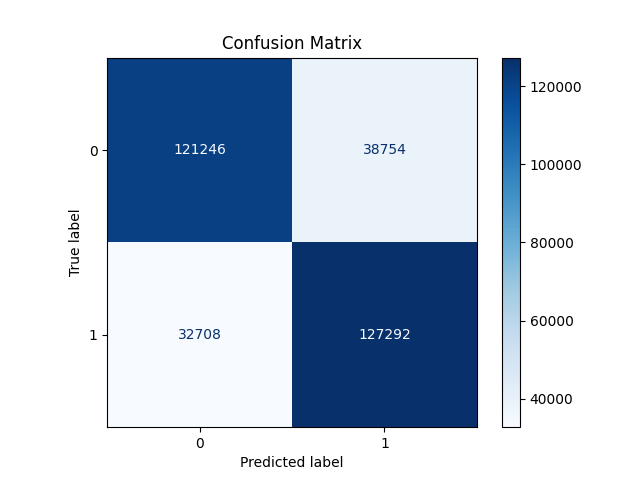

# 🐦 Twitter Sentiment Analysis using NLP

This project focuses on performing sentiment analysis on tweets using classic Natural Language Processing (NLP) techniques. The goal is to classify tweets into **Positive**, **Negative**, or **Neutral** sentiments using machine learning models.

---

## 📌 Project Overview

- 💬 Preprocesses raw tweet text (cleaning, tokenization, stopword removal)
- 🔍 Extracts features using **TF-IDF vectorization**
- 🧠 Trains a **Logistic Regression classifier**
- 📈 Evaluates the model using accuracy, classification report, and confusion matrix

---

## 🗂️ Files

- `twitter_sentiment_analysis.ipynb`: Main Google Colab Notebook with all code and output.
---

## ⚙️ Technologies Used

- **Python 3**
- **Pandas, NumPy** – data processing
- **Scikit-learn** – ML model
- **NLTK** – text cleaning and tokenization
---

## 🚀 How to Run the Project

1. Clone the repository:
   ```bash
   git clone https://github.com/Israttamu/twitter-sentiment-analysis.git
   cd twitter-sentiment-analysis
   ```

2. (Optional) Create a virtual environment and activate it:
   ```bash
   python -m venv venv
   source venv/bin/activate  # For Linux/Mac
   venv\Scripts\activate     # For Windows
   ```

3. Install required packages:
   ```bash
   pip install -r requirements.txt
   ```

4. Open the notebook:
   ```bash
   jupyter notebook
   ```

5. Run the cells in order to see results.

---

## 📊 Example Output



---


---

## 🙋‍♀️ Author

**Israt Tamanna**  
📧 israttamanna39@gmail.com
